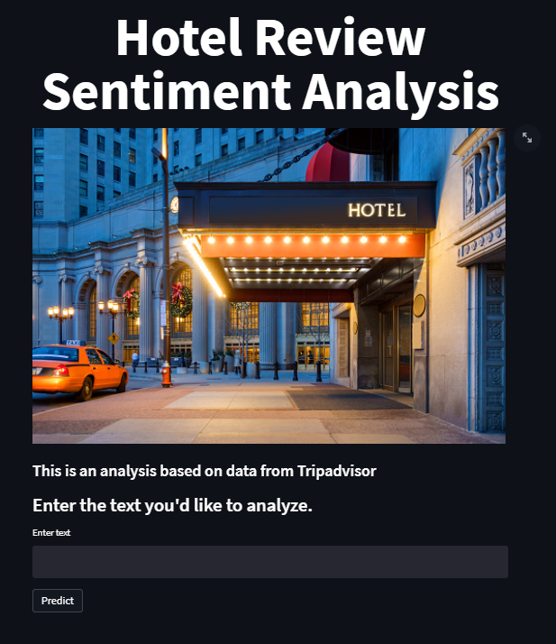

# Hotel Review Sentiment Analysis | Review4U Web Application
- 프로젝트 기간: 2021.11.08 - 2021.11.11
---

## 프로젝트 배경
**감성 분석**은 텍스트에 나타난 주관적 요소인 긍정적 감정과 부정적 감정을 판별해 이를 수치나 도식, 등급 등으로 정량화하는 작업을 말합니다.

온라인 커머스 사이트를 통해 상품을 구매한 고객들은 구매 후기, 또는 상품평을 통해 자신들의 구매 경험을 공개적으로 공유합니다.

이처럼 개인의 주관이 반영된 상품평은 브랜드, 가격 등 객관적 정보 못지않게 사람들의 구매 의사결정에 영향을 끼치기도 합니다. 

물론, 상품평에 달린 ‘별점’과 같은 간단한 수치 자료를 이용할 수도 있을 것입니다. 그러나 별점은 어떤 속성이 마음에 들고, 어떤 속성이 실망스러운지 등과 같은 상세한 정보까지 포함하지 않기 때문에 그 분석의 깊이는 다를 수 밖에 없습니다.

이 배경을 고려하여 **NLP 감성 분석 프로젝트**를 진행하였습니다.

---
## 프로젝트 목표
- 자연어 처리를 통한 호텔 영어 리뷰 감성 분석
- Streamlit로 앱을 만들고 heroku를 통해 웹에 배포
---
## 데이터셋 설명
- zendod의 Tripadvisor 데이터 활용
> - 총 20,491개의 데이터 
> - Review와 Rating 두 개의 열로 구성 

이번 프로젝트의 목적은 리뷰 데이터의 자연어 처리이기 때문에 해당 데이터셋이 리뷰데이터와 평점데이터만을 포함하고 있어, 분석에 용이하다고 판단되어 선택하게 되었습니다.

---
## 분석 과정
- 데이터 전처리 과정에서 1점부터 5점까지 분류되어 있는 평점을 이진 분류함
> - 평점이 1점과 2점에 속할 경우, 부정적 리뷰인 0으로 분류 
> - 3점, 4점, 5점에 속할 경우, 긍정적 리뷰인 1로 분류 
- 정규식을 이용하여 알파벳 소문자 이외의 구두점 삭제함
- NLP 라이브러리를 통한 불용어 처리함
- 표제어 추출함
- Affin Sentiment 사전을 통해 긍정적 리뷰와 부정적 리뷰 분류함
- 긍정적 리뷰와 부정적 리뷰를 Word Cloud를 통해 시각화함
- 실험한 구조 중에서 Accuracy가 가장 높은 것에 대해 Cross validation을 사용해서 하이퍼마라미터 튜닝을 진행함

---
## 결과
- 테스트 데이터텟(전체 데이터의 20%)에 대해서 Accyracy 약 0.98, F1 score 약 0.99인 모델을 만듦
- 구현한 모델로 Streamlit으로 앱을 만들고 heroku를 통해 웹에 배포함

